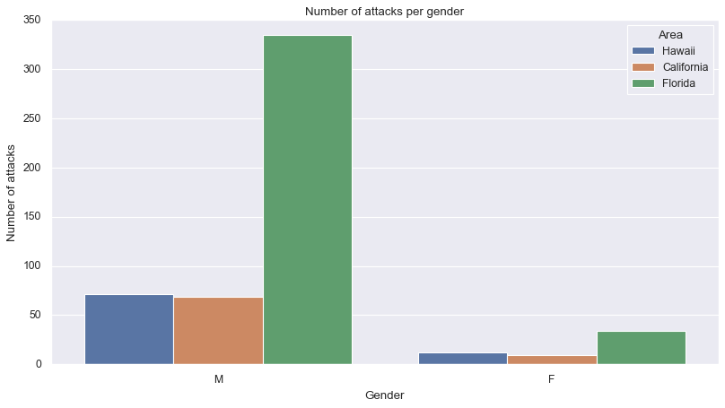

# Project I | Pandas
## Rocket Analytics' advices for John White 🚀

John White is a 17-year-old surfer from New Smyrna Beach, a coastal town in the U.S. 
state of Florida. He is really good and has a very promising future.

However, despite his short career, John has already suffered some "minor" incidences:
he was attacked by a white shark last season (luckily, he did not result injured) and 
he is now very concerned about historical shark attacks to humans beings.

John has even made some research to be able to know what places are the safest. He 
found an online dataset with plenty of information about the topic but it was to 
difficult for him to extract meaningful conclusions, so he came to Rocket Analytics to
get some help.

Rocket Analytics Inc.🚀

Rocket Analytics Inc. is a Data Consulting firm based in Barcelona.
It provides IT services to particulars, businesses, and institutions, and it is 
mostly known for its prestigious research branch.

## Shark Attacks Report
The objective of the following report is to provide John with the best advice for him
to keep pursuing the dream of becoming the best surfer in the world without dying in 
the effort.

John is still very young and does not want to move far away from home. He gave us some
indications about how he would like the new surfing spot to be.
- It must be in the United States.
- It must be in the state of Florida, Hawaii or California.
- It must have awesome sunsets (John loves to practise at afternoons, from 16 to 20).

Also, John would love to get some extra information, for instance:
- He wants to know what State has a safer summer (from June to September)
- He wants to know what are the weekdays with less shark attacks.
- He wants the study to cover only the attacks occured from 1990s.

John is a very curious guy and would appreciate as much details about the study.

Note that this report is based on the data obtained in attacks.csv file. 
It includes the descriptions of all shark attacks that have been documented along the 
history. The file is a little bit messy, each instance is classified through a wide range of variables described by people who witnessed the events.

## Table of contents
Initial DataFrame Cleaning
- Remove unnecessary values
- Remove duplicated rows
- Remove "all" NaN rows

Cleaning based on John's specifications
- Country column
- Area column
- Activity column
- Time column
- Elaboration of Month column
- Elaboration of Weekday column
- Homogeneization of Type, Fatality, Gender and Age columns

Analyses and visualizations
- Geographic distribution by States
- Fatality rates
- Gender distribution
- Yearly evolution of attacks per State
- Attacks per age group
- Hourly distribution
- Monthly distribution
- Weekday distribution

Final remarks, conclusions and recommendations for John

## Initial DataFrame Cleaning
After having received John's instructions, the first objective is to make a generic clean to our sharks attacks' database.

The process that we followed included the removal of unnecessary columns, for instance, all columns including bibliography.
Next we eliminated duplicated rows, most of them full of missing values.

## Cleaning based on John's specifications
Once the dataframe was set to work with, we applied some filters and methods to conserve the useful information according to John's requirements.  

Some of the filters were geographical, for example Country and Area, and others were relative to time period, such as years range. More on filters, we used regexs to filter by Activities, using an expression that matched surf, board and similars.

Also, we transformed some data types so that were easier to manage and apply at the time to provide visualizations to John. A great example of this task is the conversion of day time from a 16h00 format to a single integer: 16.

To finish with this part, we created new columns for Months and Weekdays, and carried a general homogeneization of Type, Fatality, Gender and Age columns.

To summarize the cleaning, we got from a messy and disorganised dataframe with more than 25000 rows to a brand new dataframe with over 550 accurate instances.

## Analyses and visualizations
In this section of the report we present the dataframe in a visual format, through some graphs, in order to make the analyses and conclusions easy to interpret.

### Geographic distribution by States
Firstly, it is important to observe how shark attacks are distributed among States. 
Florida, with 375, is the State that traditionally has more shark attacks.
Hawaii goes second with 91 and California is the State with less attacks, 80.

### Fatality rates
After his accident, John felt extremelly grateful for having survived the attack. Of course he was a privileged, since he did not suffer any major injury and the attack resulted in nothing but a scare, but the most common outcome is to survive.

In the Fatalities graph, we observe that deaths are minimal with respect to survival occurrences. The conclusions for this section are the following:
- The overall survival to death ratio is almost 58:1.
- Florida has the most attacks but the highest survival ratio.
- Hawaii is the State with less attacks but the deadliest.
- California seems to be the safest.

### Gender distribution
On gender, it is easily observable that men suffer more attacks overall. One justification that could explain this fact is that there are more men who practise surfing and other similar sports and activities. Also, women might be more prudent and avoid certain risks, so they are less exposed to shark attacks.

The presence of women in surfing has been increasing durning the last decades. Nowadays it reaches 19% of total surfers, which is still a low number. As a consequence of this increase, so has done the share of attacks received by women. The graph above supports this remarks.

### Yearly evolution of attacks per State
The yearly evolution of attacks in the US States of California, Hawaii and Florida seems to be in a decreasing trend with respect to the last decade. However, if we take the whole picture from the 90s, the trend increases slightly. Also, the number of surfers has increased during the past few years, so it is understandable that attacks have increased.

Last on this point, there are constant improvements on surfers' safety, from the early detection of sharks' presence to techniques to face their attacks, that can reduce the number and consequences of those attacks; the graph below shows that there is not a single death recorded from 2013.

### Attacks per age group
In the following graph we see the age distribution of shark attacks' victims.
The range, which has increased throughout the years, is very extense; there are instances of very young children and some cases where the victims were elders.

⚠️ Note that year starts in 1990 and goes up to 2017.

The favorite age groups are concentrated around the 20 y.o. segments. In particular boys in their last teenage years are the most attacked group.

Last but not least, we plot the graph of age groups distribution for State. It is interesting for John to see that there has not been any attack to boys in their last teen years and the beginning of their 20s.

### Hourly distribution
It is very important for John to know in what hours sharks are more active; his intention was to surf from 16 to 20.

In the graph below we have plotted the hourly distribution of the attacks and the results that we have obtained are good news for John's interests: sharks are mostly active during the late morning, midday and early afternoon. There is a considerable drop around 16:00h.

Therefore, his initial schedule idea is safe to carry on, John will be able to enjoy his fruit shakes while watching sunset after surf sessions!

### Monthly distribution
Surfing season hits its peak during summer, from June to September. It's the period in which conditions are the best, both in the sea and outside, to hold competitions and events.
Hence, John wanted to know which is the State with a "safest" summer.

In the graph below there is the monthly distribution of shark attacks by State, and we clearly observe that there are four months that register a remarkable number of attacks: 
April, August, September and October.

A good recomendation for John would be to compete in May and as well as in his preferred months, and reduce a bit the activity in September.

### Weekday distribution
Last but not least, we plotted the distribution of the attacks by weekdays.
The results show that human beings are a haute cuisine dish for sharks and they mostly eat this delicacy on weekends. The weekday with less attacks is Tuesday.

## Final remarks, conclusions and recommendations for John
California is the State that has the lesser number of attacks and deaths.

Boys in their late teen years and early 20s are the gender and age group more likely to be attacked.

The number of attacks has increased slightly during the past decades despite of the increase of surfer practicioners. Safety measures are working out.

Sharks prefer humans for lunch over other meals, they are not that active from 16:00 onwards. John will be able to enjoy sunsets!

Sharks don't do holidays: they work the most on summer months, September and August, as well as on April and October. It would be good for John to surf more on May and reduce activity on September.

Sharks love to eat some delicacies on weekends, avoid surfing on Saturdays and Sundays.

Good luck John in your career and surf safe!

